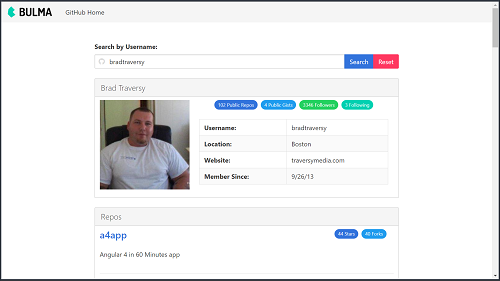

# Angular GitHub Search App
This project is the result of my code-along to the Angular GitHub app, [Angular 2 GitHub Application (RC6 Update)](https://www.youtube.com/watch?v=RL_2FnIBVgI) by *Brad Traversy*.  There have been minor updates to the original code, but the app is for the most part, the same.  This project was originally developed in Angular 2 RC6 and has been updated to **Angular 5** and styled using the [Bulma CSS Framework](https://bulma.io).

     

## Versions
* [Angular CLI](https://github.com/angular/angular-cli) v1.6.6
* Angular v5.2.2
* [Bulma](https://bulma.io) v0.6.2

## Installation
1. Clone this repo `git clone https://github.com/stanleyeosakul/angular-github-search.git`
1. `cd` into the folder of the cloned repo
1. Run `yarn install` to install dependencies
1. Run `ng serve`, and navigate to `http://localhost:4200/`
